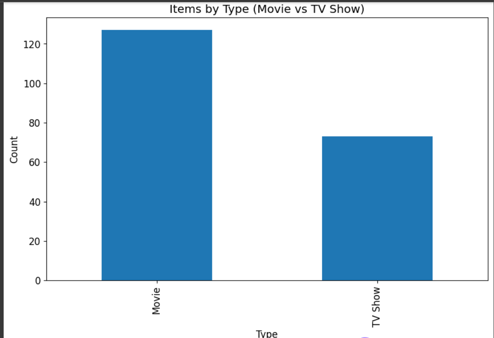
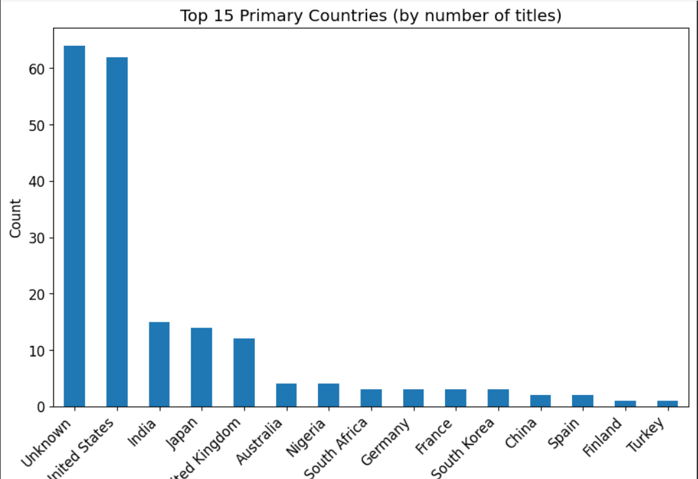
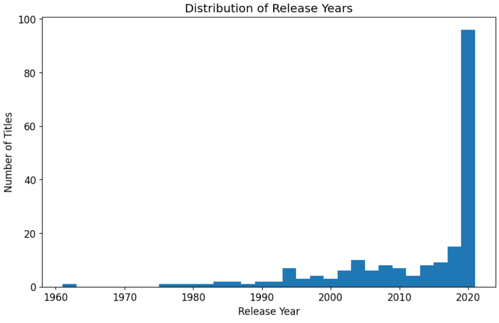
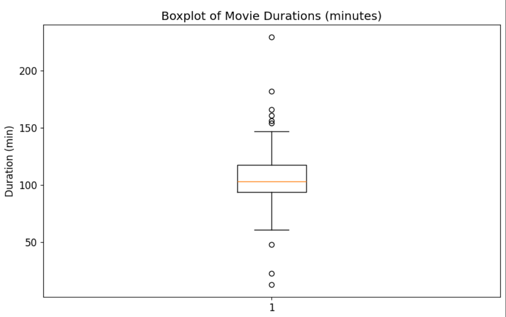
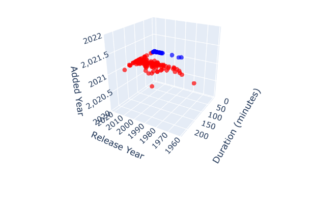
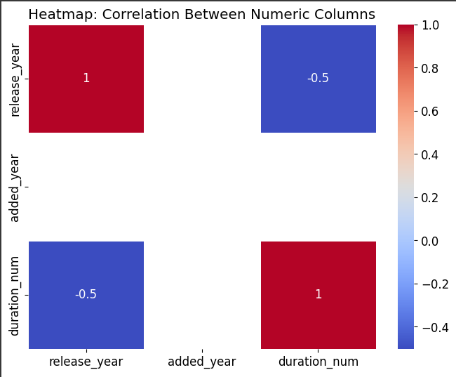
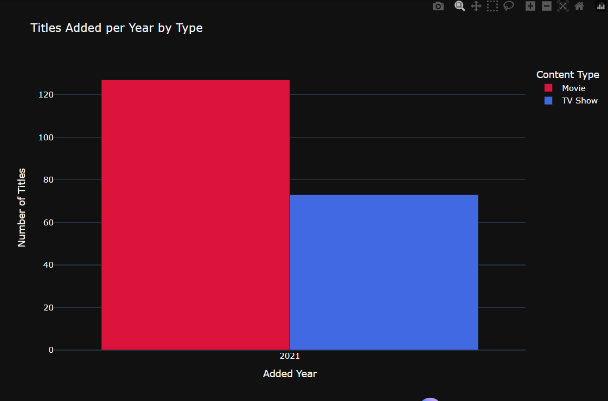

# 🎬 Netflix Data Analysis & Visualization (Python | Colab | Plotly)

### 📌 Overview
This project performs **data cleaning, exploration, and visualization** on the Netflix titles dataset (`Netflix.json`).  
It uses **Python 3**, **Pandas**, **Matplotlib**, **Seaborn**, and **Plotly** within **Google Colab** to uncover insights such as:
- Year-wise growth of movies and TV shows on Netflix  
- Country-wise content distribution  
- Genre popularity trends over time  
- Movie duration patterns and release-year analysis  

### 🎯 Objectives
- Clean and preprocess the raw JSON dataset  
- Handle missing values & duplicates  
- Normalize duration, date, and genre information  
- Perform **Exploratory Data Analysis (EDA)**  
- Generate **interactive visualizations** for deeper insights  

---

## 🧰 Tech Stack
| Category | Tools / Libraries |
|-----------|------------------|
| Language | Python 3 |
| Data Handling | Pandas, NumPy |
| Visualization | Matplotlib, Seaborn, Plotly |
| Environment | Google Colab |
| Version Control | Git + GitHub |

---

## 🧹 Data Cleaning Steps
1. **Loaded** the Netflix dataset (`Netflix.json`) into a Pandas DataFrame  
2. **Standardized** column names and trimmed whitespaces  
3. **Parsed** date fields (e.g., `date_added`) into `datetime` objects  
4. **Normalized** duration (minutes / seasons)  
5. **Split** multi-valued columns (`cast`, `country`, `listed_in`) into lists  
6. **Handled** missing values using imputation / placeholder logic  
7. **Removed** duplicates based on `show_id` and `title + release_year`  
8. **Exported** a cleaned dataset (`netflix_cleaned.csv`) for further analysis  

---

## 📊 Exploratory Data Analysis (EDA)
Key analyses performed:
- Content type distribution (Movie vs TV Show)  
- Rating distribution across types  
- Country and genre frequency  
- Correlation heatmap between numeric features  
- 3D scatter plots using Plotly (Release Year × Duration × Type)  
- Genre-over-time heatmap  

---

## 🌈 Visualizations Preview
Below are a few examples of generated plots (replace with your screenshots):

| Visualization | Preview |
|----------------|----------|
| Bar Chart |  |
| Bar Chart|  |
| Histogram |  |
| Boxplot |  |
| Interactive 3D render |  |
| Numeric_Heatmap |  |
| Group_BarChart |  |

> 🖼️ To insert screenshots, save them in a `figures/` folder and reference them with relative paths as shown above.

---

## 🚀 How to Run This Project

### 🔹 Option 1: Open in Google Colab
Click the badge below to launch instantly in Colab:

[](https://colab.research.google.com/github/yourusername/netflix-eda/blob/main/notebooks/netflix_eda.ipynb)

### 🔹 Option 2: Run Locally
```bash
git clone https://github.com/yourusername/netflix-eda.git
cd netflix-eda
pip install -r requirements.txt
jupyter notebook notebooks/netflix_eda.ipynb


📈 Key Insights

📅 Sharp rise in content added after 2015
🎞️ Movies form ~70% of total titles
🌍 US, India, UK top content producers
🎭 Drama & Comedy most common genres
⏱️ Average movie duration ≈ 100 minutes
🧠 Learnings

Hands-on data wrangling and cleaning in Pandas
Feature engineering (date, duration, multi-value columns)
Interactive EDA with Plotly
GitHub project structuring and documentation
🪪 License
This project is licensed under the MIT License.
You are free to use, modify, and share with attribution.